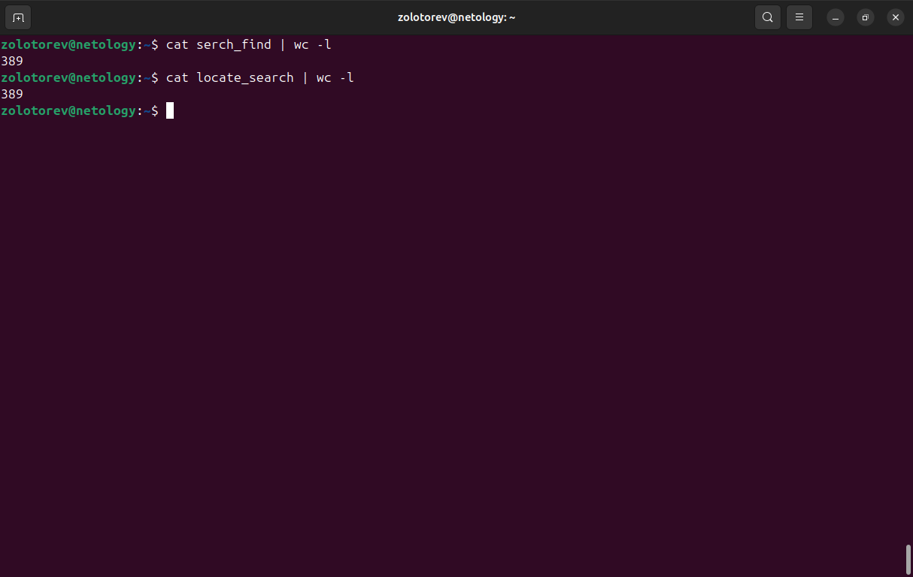
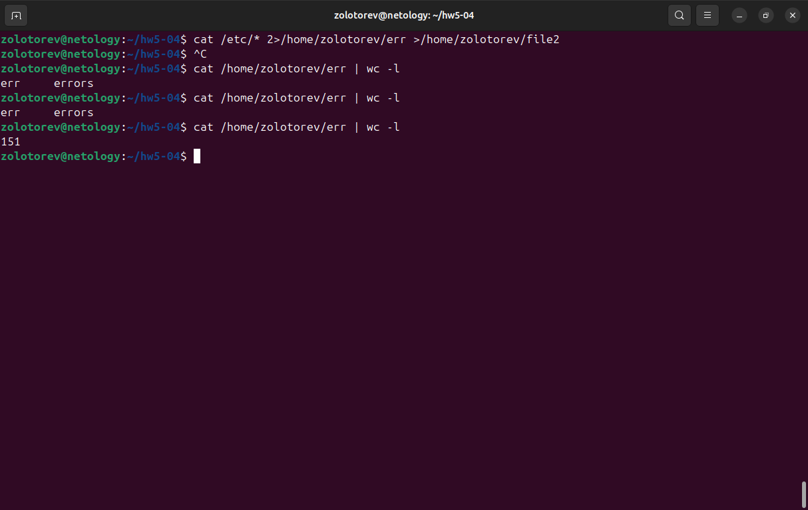
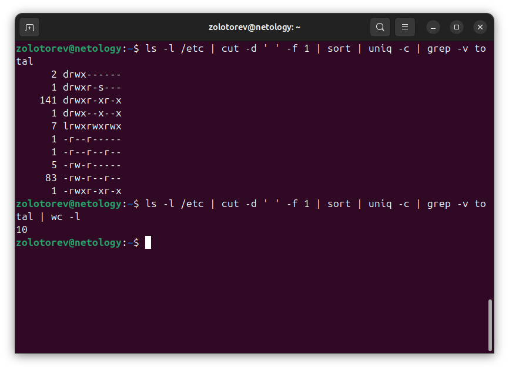

# Домашнее задание к занятию "Работа с текстовыми утилитами"
### Золоторев Н.Д.

### Задание 1.

   1. Найдите все файлы с расширением .conf в /etc сначала с помощью команды find, а потом с помощью команды locate;
   2. Перенаправьте результаты работы каждой команды в разные файлы;
   3. Подсчитайте количество найденных файлов в каждом случае с помощью wc.

### Решение 1.
sudo find /etc -name '*.conf' > serch_find
cat serch_find | wc -l

locate "/etc/*.conf" > locate_search
cat locate_search | wc -l

### Задание 2.

   1. Выведите с помощью cat содержимое всех файлов в директории /etc cat /etc/*;
   2. Направьте ошибки в отдельный файл в вашей домашней директории;
   3. Стандартный поток вывода направьте в другой файл;
   4. Подсчитайте, сколько объектов не удалось прочитать.

### Решение 2.

cat /etc/* 2>/home/zolotorev/err >/home/zolotorev/file2

### Задание 3.

   1. Перенаправьте результат работы команды ls -l в каталоге с большим количеством файлов в утилиту cut, чтобы отобразить только права доступа к файлам;
   2. Отправьте в конвейере этот вывод на sort и uniq, чтобы отфильтровать все повторяющиеся строки;
   3. Уберите из подсчета строку total;
   4. С помощью wc подсчитайте различные типы разрешений в этом каталоге.

### Решение 3.

ls -l /etc | cut -d ' ' -f 1 | sort | uniq -c | grep -v total

s -l /etc | cut -d ' ' -f 1 | sort | uniq -c | grep -v total | wc -l

